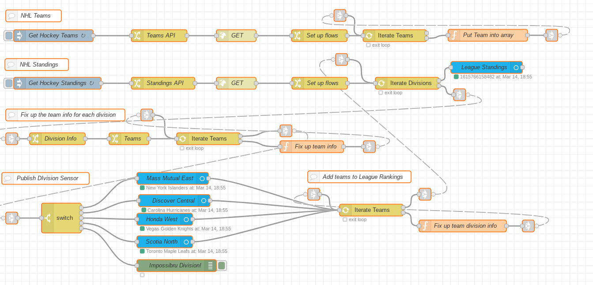

# NHLStandings-HA
Node-RED flow to create NHL standings sensors in HomeAssistant

## Requirements
* node-red-contrib-home-assistant-websocket: https://flows.nodered.org/node/node-red-contrib-home-assistant-websocket
* hass-node-red integration (Install via HACS): https://github.com/zachowj/hass-node-red
* List Card by @iantrich (Install via HACS): https://github.com/iantrich/list-card

## Installation
If you don't yet have [node-red-contrib-home-assistant-websocket](https://flows.nodered.org/node/node-red-contrib-home-assistant-websocket) set up, you will need to configure that in Node-RED and also install the [hass-node-red integration](https://github.com/zachowj/hass-node-red) in Home Assistant.  It's definitely useful not only for this, but for many other automations.

You will also need [List Card by @iantrich](https://github.com/iantrich/list-card) installed in Home Assistant in order to display the information.  It's meant to use with the FeedParser integration, but will work with any sensor data as long as it's formatted reasonably and not multi-level, which is what a lot of fixing that the Node-RED flow does.

[lovelace-card-mod](https://github.com/thomasloven/lovelace-card-mod) would be useful for styling the tables so they are not so fugly.

The YAML fileis for a complete dashboard.  You can paste it into the raw configuration editor on a new Lovelace dashboard. I plan on converting it to use Decluttering card at some pont to make it more manageable. 
